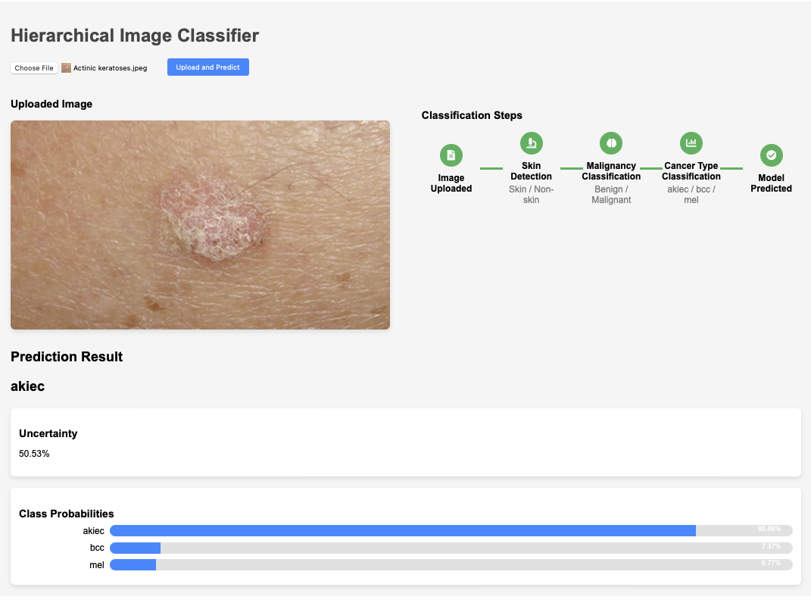
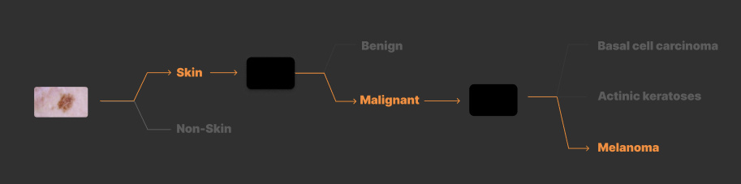
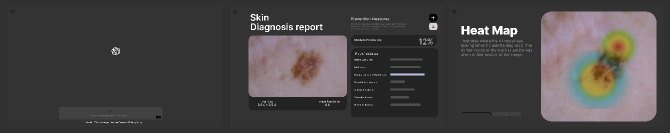

# ReadME





```
backend
    ├── app.py                     # inference
    ├── model_4.keras               # model weights
    ├── requirements.txt
frontend
    ├── public
    │   ├── ...
    ├── src
    │   ├── App.css 
    │   ├── App.js
    │   ├── App.test.js
    │   └── index.js
    ├── package.json
    ├── package-lock.json
step_1                                  # Skin or Non-Skin
    ├── inference_skin_nonskin.ipynb               
    ├── preprocess_coco.py          
    ├── preprocess_skin.py
    ├── skin_nonskin_classifier.py
    ├── README.md
step_2                                  # Malignant or Benign
    ├── cancer_noncancer_classifier.py              
    ├── ham10000_eda.ipynb          
    ├── ham10000.py
    ├── README_2.md
step_3                                  # Mel, Bcc ,Scc
    ├── ham10000_malignant.py              
    ├── malignant_train.py         
    ├── README.md
ui
    ├── ...                     
```


# UI Designs

```
Detailed discussion in the UI.md file
```

## v1


## v2




Figma: https://www.figma.com/design/NdtFBlTj6g0E0xhGH18msF/SearchGPT?node-id=0-1&node-type=CANVAS&t=kYT1Qnh3UBI5Y6Kd-0 


# Frontend 
Using React 

```bash
cd alphacare_v4/AlphaCare_v4/frontend
```

```bash
npm start
```

# Backend
Previously I used the FastAPI to create API Layer. I switched to Flask for the backend due to the ease of use. 

```bash
cd alphacare_v4/AlphaCare_v4/backend 
```
```bash
python3 -m venv venv
```
```bash
source venv/bin/activate
```

```bash
python3 app.py
```

# Models
For all 3 of the hierarchial classifications I use the same model architecture. The model is the pretrained ResNet18 Model. ResNet comes in various models like ResNet18, ResNet34, ResNet50, ResNet101, and ResNet152. I used ResNet18 because it is lightweight. I need to conduct more tests to see if larger models make a substantial difference. 


```python
model = models.resnet18(weights=models.ResNet18_Weights.DEFAULT)
num_ftrs = model.fc.in_features

# Replace the last layer with a binary classification layer
model.fc = nn.Linear(num_ftrs, NUM_CLASSES)
```

IDEAS: 
- I should consolidate all the train files to one file that can be used for all hierarchies. I can use a simple pointer to the different pre-processed datasets.
- If I use segmentation algorithm I can zoom into the segmented area and provide more resolution without increasing the image size.

# Bugs
1. Make sure using Global Environment Python Version 3.11 not the local version 3.9
2. Make sure you are always inside the skin-cancer-detector directory when launching frontend or backend