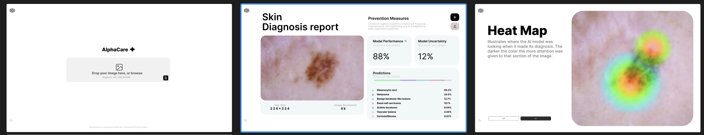

# ReadME


```
backend
    ├── app.py                     # inference
    ├── model_4.keras               # model weights
    ├── requirements.txt
frontend
    ├── public
    │   ├── ...
    ├── src
    │   ├── App.css 
    │   ├── App.js
    │   ├── App.test.js
    │   └── index.js
    ├── package.json
    ├── package-lock.json
mnist
    ├── heatmap.ipynb               
    ├── mnist_train.ipynb           
    ├── uncertainty_quantification.ipynb
pytorch
    ├── ...                     
ui
    ├── ...                     
```

# How To Run 
1. Open the terminal and run the following command: 


```bash
cd Downloads 
```
```bash
git clone https://github.com/rjoseph6/AlphaCare_v4.git
```
We are downloading the project from the repository.

2. Run these commands to start the frontend:

```bash
cd AlphaCare_v4/frontend
```

```bash
npm install
```

```bash
npm start
```

4. A browser window should open with the frontend running. 


5. Start a NEW second terminal

6. Run these commands in the new terminal

```bash
# go into app
cd Downloads/AlphaCare_v4/backend 
```
```bash
python3 -m venv venv
```
```bash
source venv/bin/activate
```
```bash
pip3 install -r requirements.txt
```
```bash
python3 app.py
```

6. The frontend (browser) should now be connected to the backend (python script). 

7. Go to the browser that was initially opened. Input an image of a skin disease (Melanoma/Vascular Lesion) and click the "Submit" button. The model will predict the image and display the results.


8. More detailed output of the model can be seen in the terminal where the backend is running.


# UI Designs

```
Detailed discussion in the UI.md file
```

## v1


## v2


Figma: https://www.figma.com/design/NdtFBlTj6g0E0xhGH18msF/SearchGPT?node-id=0-1&node-type=CANVAS&t=kYT1Qnh3UBI5Y6Kd-0 


# Frontend 
Using React 

# Backend
Previously I used the FastAPI to create API Layer. I switched to Flask for the backend due to the ease of use. 

# Models
## Testing Model 
This model was quickly trained on a very easy dataset (HAM10000). It is just a test model to see if the backend and frontend are working. 

```python
# model weights
model_3.keras
```

## Official Model
Model design decisions were made based on the following:
https://github.com/Tirth27/Skin-Cancer-Classification-using-Deep-Learning

```python
# pretrained model EfficientNetB4
base_model = EfficientNetB4(input_shape=IMG_SHAPE, include_top=False, weights='imagenet')

# Adding custom layers
x = base_model.output
x = Flatten()(x)
x = Dense(500, activation='relu', name='500_Dense')(x)
x = Dense(256, activation='relu', name='256_Dense')(x)
predictions = Dense(NUM_CLASSES, activation='softmax', name='Final')(x)

model = Model(inputs=base_model.input, outputs=predictions)

# Unfreeze the top 20 layers, except BatchNorm layers
for layer in model.layers[-20:]:
    if not isinstance(layer, tf.keras.layers.BatchNormalization):
        layer.trainable = True  # Keep True to train, False to freeze

model.compile(loss='categorical_crossentropy', optimizer='adam', metrics=['accuracy'])
```


# Bugs
1. Make sure using Global Environment Python Version 3.11 not the local version 3.9
2. Make sure you are always inside the skin-cancer-detector directory when launching frontend or backend