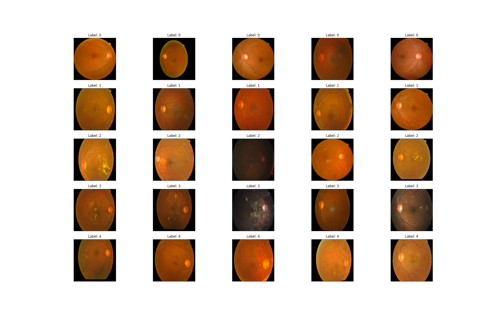
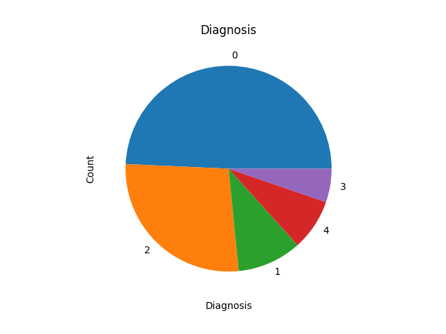
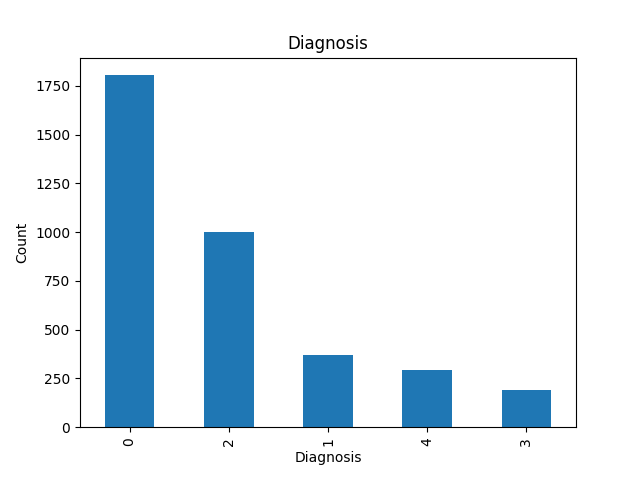

# ReadMe


TODO 
- Create a centralized train script
- Preprocess data into folders for each class


# Datset

## APTOS 2019 Blindness Detection

Detect diabetic retinopathy to stop blindness before it's too late. A clinician has rated each image for the severity of diabetic retinopathy on a scale of 0 to 4:
0 - No DR
1 - Mild
2 - Moderate
3 - Severe
4 - Proliferative DR

Dataset is roughly > 10 GB. 

# Data Preprocessing







# Processed Data
```
Training Directory Structure:
Class 0: 1444 images
Class 1: 296 images
Class 2: 799 images
Class 3: 154 images
Class 4: 236 images

Validation Directory Structure:
Class 0: 180 images
Class 1: 37 images
Class 2: 100 images
Class 3: 20 images
Class 4: 29 images

Test Directory Structure:
Class 0: 181 images
Class 1: 37 images
Class 2: 100 images
Class 3: 19 images
Class 4: 30 images
```

