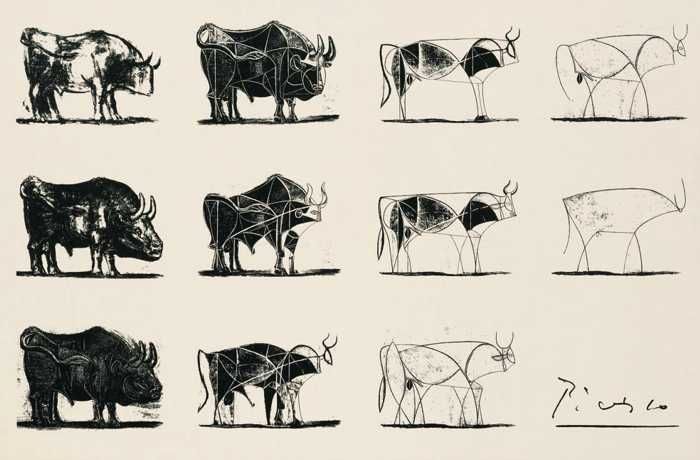
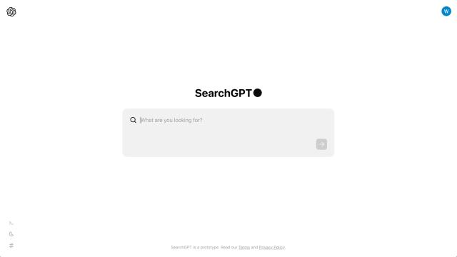
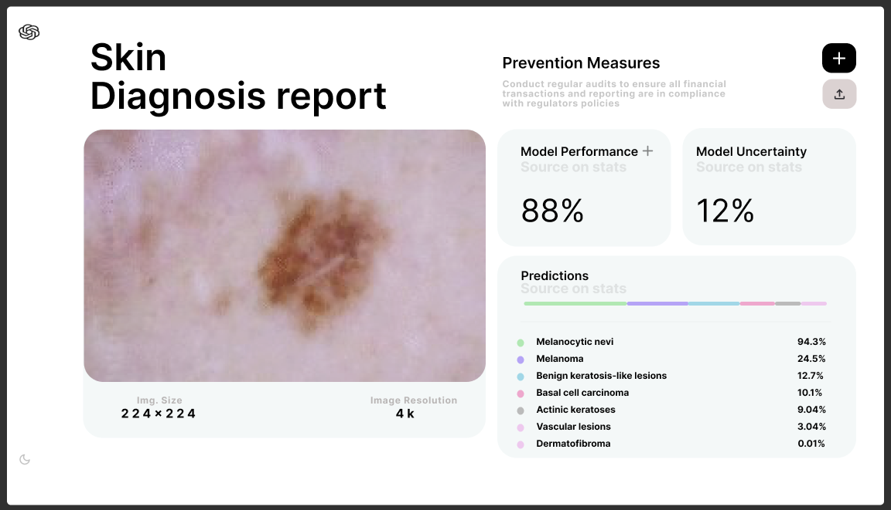
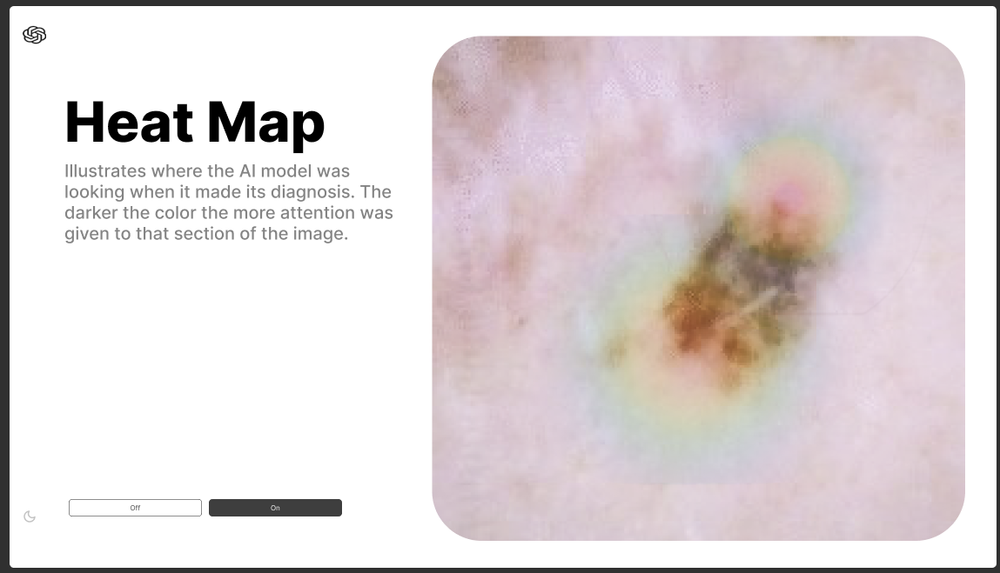
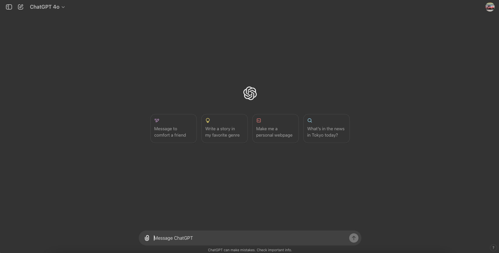
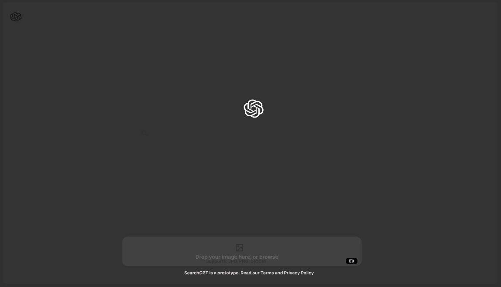
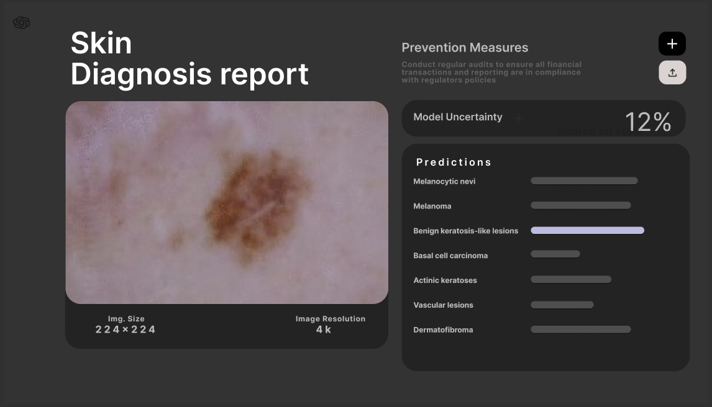
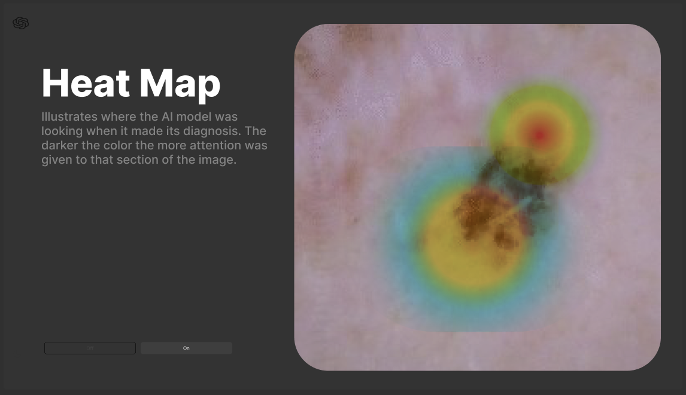

# User Interface (UI)

## Design Methodology
Inspired by Steve Jobs favorite painting. The painting is by Pablo Picasso. In the series of paintings he kept abstracting away details while maintaining the essence. This is what I want to do with the UI. I want to simplify it as much as possible.

# Ideas
- The new OpenAI o1 model has a cool UI. It shows what its thinking on a single line. The line changes from time to time. I want to do something similar. It has subtle animations such as the line moving from left to right.

# v1

The first version of the UI was inspired by SearchGPT from OpenAI.

## v2
This design was inspired more by the ChatGPT interface. The reason I liked this more than SearchGPT ui was because of the dark theme but also the 4 sample prompts. 

Simplifying the UI more and more. I didnt think we needed model performance on the diagnosis page.

### next

I also believe I dont need the image dimensions on the diagnosis page. So the next iteration I will remove that. Maybe I will only display it when the user uploads an image thats not good.

# Design Software
I use Figma to design the UI.

https://www.figma.com/design/NdtFBlTj6g0E0xhGH18msF/SearchGPT?node-id=0-1&node-type=CANVAS&t=kYT1Qnh3UBI5Y6Kd-0 