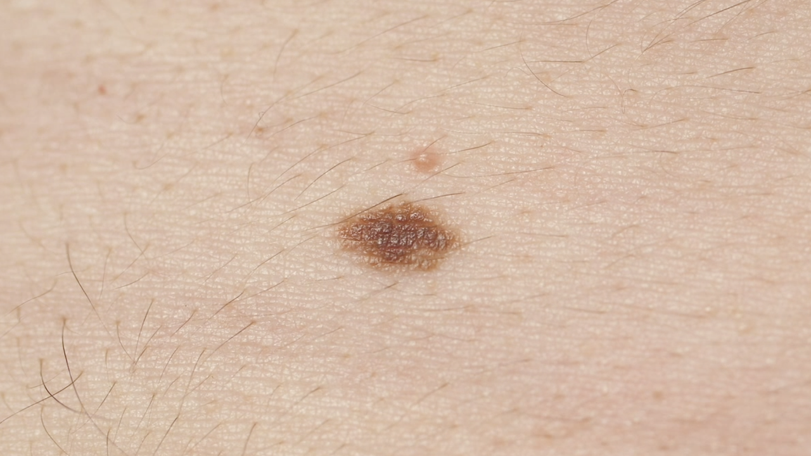
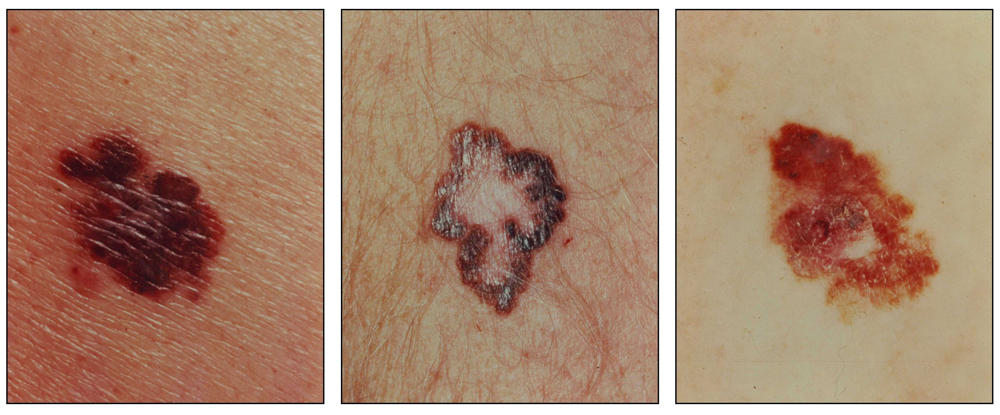

# Diagnosing Skin Diseases

Steps for Diagnosing Skin Disease

1. Patient History and Physical Examination

Dermatologist use ABCDE criteria to assess suspicious moles and skin lesions. The ABCDE criteria are:

A - Asymmetry (one half of the mole does not match the other half)

B - Border irregularity (the edges of the mole are ragged or notched)

C - Color (the color of the mole is not uniform)

D - Diameter (the mole is larger than 6 mm in diameter)

E - Evolving (the mole is changing in size, shape, or color)

2. Dermoscopy

A non-invasive technique that uses a handheld instrument (dermatoscope) to examine the skin. It magnifies the skin structures and patterns that are not visible to the naked eye.

The dermatologist is looking for specific patterns that indicate different types of skin cancers. For example:

- Melanoma: Irregular network patterns, asymmetry, and multi-colored areas

    - one of the most dangerous forms of skin cancer (metasize to other organs)
    - Classification: MALIGNANT
    - Prognosis: early detection is crucial, as it can be life threatening

- Basal Cell Carcinoma (BCC): Arborizing (branch freely) blood vessels, leaf-like areas, and translucent nodules
    - most common type of skin cancer. arises from lowest skin layer. Grows slowly and rarely metastizes.
    - Classification: MALIGNANT, less aggressive bec/ rarely spreads
    - Prognosis: good if treated early can cause local tissue damage

- Squamous Cell Carcinoma (SCC): White scales, crusts, and vascular patterns
    - starts in outermost layer of skin. More aggressive than BCC and can spread to other parts of the body.
    - Classification: MALIGNANT
    - Prognosis: potentially life threatening if invades deeper tissues. It has good prognosis with early detection and treatment

- Melanocytic Nevi (nv)
    - Appearance: small, round, oval moles iwth smooth borders. Colors vary from pink to dark brown
    - Classification: BENIGN
    - Prognosis: harmless in most casses

- Benign Keratosis-like Lesions (bkl)
    - seems to be referred to as seborrheic keratosis
    - Appearance: warty, waxy, or scaly growths. Often mistaken for melanoma due to their uneven surface and color variation.
    - Classification: BENIGN
    - Prognosis: harmless in most cases. Can be removed for cosmetic reasons

- Actinic Keratoses (akiec)
    - Appearance: Rough, scaly patches that may be red, pink, or brown. Often appear on sun-exposed areas like face, scalp, and arms.
    - Development: caused by prolonged sun exposure. Can develop into squamous cell carcinoma (MALIGNANT) if left untreated.
    - Classification: PRECANCEROUS -> MALIGNANT
    - Prognosis: good if treated early and prevent progression to SCC (MALIGNANT)

- Vascular Lesions (vasc)
    - Appearance: red, purple, or blue nodules or patches caused by blood vessel abnormalities.
    - Development: Benign overgrowths of blood vessels. Can be congenital or develop over time.
    - Classification: BENIGN
    - Prognosis: harmless in most cases. Can be removed for cosmetic reasons

- Dermatofibroma (df)
    - Appearance: small, firm, and often pigmented nodules. They may appear as pink, brown, and tan bumps.
    - Development: thought to result from an overreaction to minor skin trauma, such as insect bites or ingrown hairs
    - Classification: BENIGN
    - Prognosis: harmless in most cases. Can be removed for cosmetic reasons

3. Biopsy

If a lesion is very suspicious after visual examination and dermascopy, a dermatologist will take a biopsy to get a definitive diagnosis. A histopathological examination is performed on the biopsy sample to determine the type of skin cancer. During this histopathological examination, the pathologist looks at the biopsy under a microscope to identify the type of skin cancer and its characteristics. The feature characteristics they are looking for are cell shapes, growth patterns, and leveles of invasion into surrounding tissues. The pathologist can confirm:
- Type of skin cancer (Melanoma, BCC, SCC)
- The stage of the cancer (how deep it has invaded and if it has spread)
