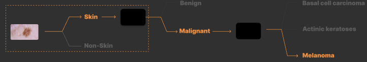
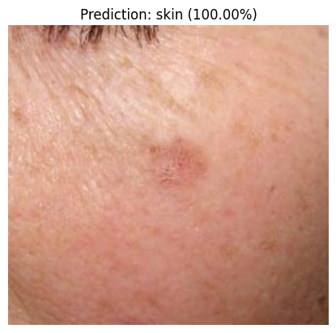

# Skin vs. Non-Skin (Hierarchical Classification #1)




This repository contains the code and instructions for the first part of our hierarchical skin disease classification project: Classifying images as ‘skin’ or ‘non-skin’. This initial classification step is crucial in our pipeline to ensure that subsequent models only process relevant images.

## Table of Contents
1. [Overview](#overview)
2. [Dataset Preparation](#dataset)
3. [Directory Structure](#structure)
4. [Usage](#usage)
5. [Model Architecture](#models)
6. [Results](#results)

## Overview <a name="overview"></a>

In this part of the project, we focus on building a binary classifier to distinguish between images containing skin (lesions, skin diseases, etc.) and images that do not contain skin (general objects and scenes). This classifier acts as the first filter in our hierarchical pipeline for skin disease detection.

## Dataset Preparation <a name="dataset"></a>

### Skin Images
For the skin category we use the datasets that we trained our skin disease classification model on. These datasets contain images of various skin diseases and lesions. We are making use of pre-existing datasets. The datasets used are:
- [HAM10000](https://dataverse.harvard.edu/dataset.xhtml?persistentId=doi:10.7910/DVN/DBW86T) - A large collection of multi-source dermatoscopic images of common pigmented skin lesions.

### Non-Skin Images
For the non-skin category, we use the following dataset COCO. This dataset is 19 GB in size and contains over 200,000 images. We use the COCO dataset as a source of non-skin images. The COCO dataset contains images of common objects and scenes.
- [COCO](https://cocodataset.org/#home) - Common Objects in Context dataset with over 200,000 labeled images.

```python
# Download and extract the COCO dataset
python3 preprocess_coco.py
```

## Directory Structure <a name="structure"></a>

```
AlphaCare_v4/
├── datasets/
│   ├── train/
│   │   ├── skin/
│   │   │   ├── image1.jpg
│   │   │   ├── image2.jpg
│   │   │   └── ...
│   │   └── non-skin/
│   │       ├── image1.jpg
│   │       ├── image2.jpg
│   │       └── ...
│   └── val/
│       ├── skin/
│       │   ├── image1.jpg
│       │   ├── image2.jpg
│       │   └── ...
│       └── non-skin/
│           ├── image1.jpg
│           ├── image2.jpg
│           └── ...
├── coco_data/
│   ├── train2017/
│   │   └── [All COCO training images]
│   └── annotations/
│       └── [COCO annotations]
├── skin_vs_nonskin/
│   ├── preprocess_coco.py
│   ├── skin_nonskin_classifier.py # training
└── README.md
```

## Usage <a name="usage"></a>

1. Preparing the COCO Dataset

To prepare the non-skin dataset, download the COCO dataset and extract the images and annotations. Run the following command to preprocess the COCO dataset:

```python
python3 preprocess_coco.py
```

2. Training the Classifier
Once the datasets are prepared and organized, use the skin_nonskin_classifier.py script to train the binary classifier.

```python
python3 skin_nonskin_classifier.py
```
•	Loads and preprocesses the images with data augmentation and normalization.

•	Uses a pre-trained ResNet18 model from torchvision.

•	Replaces the final classifier layer to output two classes: ‘skin’ and ‘non-skin’.

•	Trains the model using cross-entropy loss and the Adam optimizer.

•	Saves the trained model weights to skin_non_skin_model.pth.

## Model Architecture <a name="models"></a>

We use ResNet18 architecture as the backbone. We replace the final classifier layer to output two classes: ‘skin’ and ‘non-skin’.

```python
model = models.resnet18(weights=models.ResNet18_Weights.DEFAULT)
num_ftrs = model.fc.in_features
# Replace the last layer with a binary classification layer
model.fc = nn.Linear(num_ftrs, NUM_CLASSES)
```

## Results <a name="results"></a>

```python
Epoch 1/5
------------------------------
Train Phase:   0%|                                                                                                                 | 0/202 [00:00<?, ?batch/s]Using MPS (Metal Performance Shaders) 
Train Phase: 100%|███████████████████████████████████████████████████████████████████████████████████████████| 202/202 [01:40<00:00,  2.01batch/s, loss=0.204]
Train Loss: 0.0184 Acc: 0.9954
Val Phase:   0%|                                                                                                                    | 0/40 [00:00<?, ?batch/s]Using MPS (Metal Performance Shaders)
Val Phase: 100% █████████████████████████████████████████████████████████████████████████████████████████████| 40/40 [00:30<00:00,  1.33batch/s, loss=4.83e-5]
Val Loss: 0.0004 Acc: 1.0000

....

Epoch 5/5
------------------------------
Train Phase:   0%|                                                                                                                 | 0/202 [00:00<?, ?batch/s]Using MPS (Metal Performance Shaders) 
Train Phase: 100%|█████████████████████████████████████████████████████████████████████████████████████████| 202/202 [01:39<00:00,  2.03batch/s, loss=1.29e-5]
Train Loss: 0.0025 Acc: 0.9992
Val Phase:   0%|                                                                                                                    | 0/40 [00:00<?, ?batch/s]Using MPS (Metal Performance Shaders) 
Val Phase: 100%|█████████████████████████████████████████████████████████████████████████████████████████████| 40/40 [00:30<00:00,  1.32batch/s, loss=1.89e-7]
Val Loss: 0.0006 Acc: 0.9996
```

Model Weights are stored in:
```python
.../weights/skin_non_skin_model_mps.pth
```


