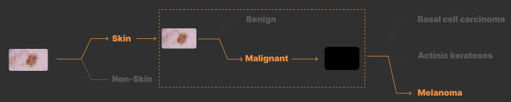
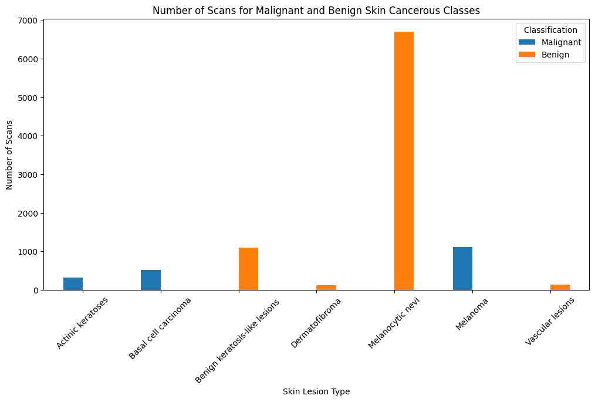
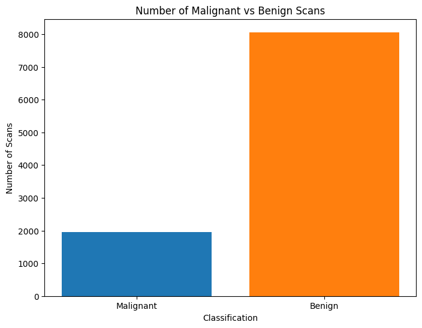
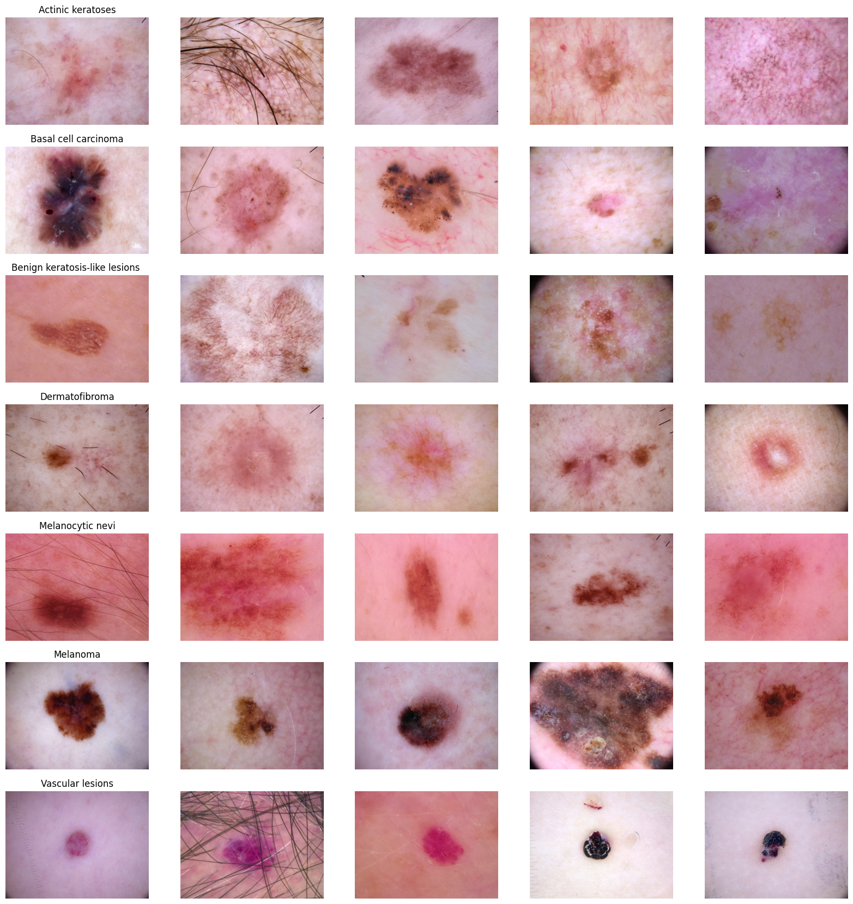
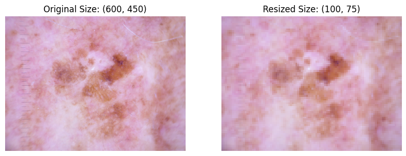
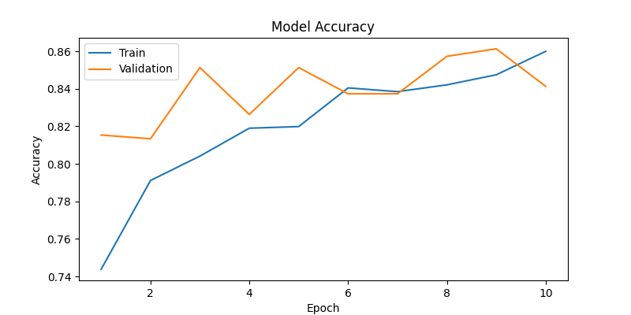
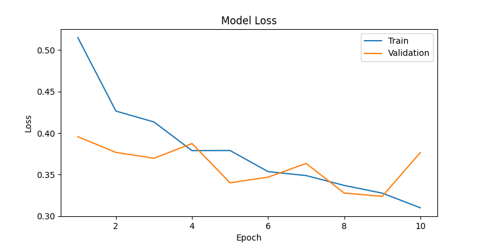

# Malignant Skin Cancer vs. Benign Skin Disease (Hierarchical Classification #2)




In this second stage of the hierarchical skin disease detection project, we focus on building a model that differentiates between MALIGNANT skin cancer and BENIGN skin cancer. 


--- need to change tables to say malignant and benign -----

## Table of Contents
1. [Overview](#overview)
2. [Dataset Preparation](#dataset)
3. [Directory Structure](#structure)
4. [Usage](#usage)
5. [Model Architecture](#models)
6. [Results](#results)

## Overview <a name="overview"></a>

The malignant cancerous classes include melanoma, basal cell carcinoma, and squamous cell carcinoma. The benign cancerous classes include actinic keratosis, benign keratosis, dermatofibroma, and vascular lesions.


## Dataset Preparation <a name="dataset"></a>

### HAM10000

The HAM10000 dataset is a collection of 10,015 dermatoscopic images of common pigmented skin lesions. The data consists of 7 classes of skin cancer, including melanoma, basal cell carcinoma, actinic keratoses, benign keratosis, dermatofibroma, and vascular lesions. 

## Class Balance




# Preprocessing
Original Images 




## Image Resize 
The images are downsized to fit into the classifer


## Train-Val-Test Split

```
---------------------- Training Set ----------------------
  Train - Cancer: 1563
  Train - Non-Cancerous: 6448
---------------------- Validation Set ----------------------
  Validation - Cancer: 196
  Validation - Non-Cancerous: 806
---------------------- Test Set ----------------------
  Test - Cancer: 195
  Test - Non-Cancerous: 807
```

# Model Architecture <a name="models"></a>

The model is a Convolutional Neural Network (CNN) with the following architecture:

```python
model = models.resnet18(weights=models.ResNet18_Weights.DEFAULT)
num_ftrs = model.fc.in_features
# Replace the last layer with a binary classification layer
model.fc = nn.Linear(num_ftrs, NUM_CLASSES)
```

## Class Weights
Need to fix the numbers are too low for some reason
```bash
Using MPS device
Training : Counter({1: 6448, 0: 1563})
Validation : Counter({1: 806, 0: 196})
Test : Counter({1: 807, 0: 195})
Class weights: [0.0006397952655150352, 0.00015508684863523573]
```

# Results <a name="results"></a>

## Training

Accuracy


Loss 



## Testing 

```python
Evaluating on test set...
Test Loss: 0.3347, Test Accuracy: 0.8623
```