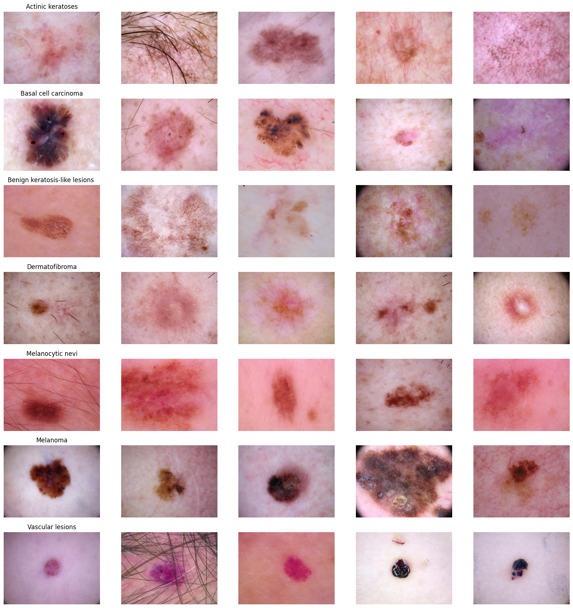

# Melanoma vs. Basal Cell Carcinoma vs. Squamous Cell Carcinoma (Hierarchical Classification #3)


In this third stage of the hierarchical skin disease detection project, we focus on building a model that differentiates between the different MALIGNANT skin cancers: melanoma, basal cell carcinoma, and squamous cell carcinoma.


--- need to change tables to say malignant and benign -----

## Table of Contents
1. [Overview](#overview)
2. [Dataset Preparation](#dataset)
3. [Directory Structure](#structure)
4. [Usage](#usage)
5. [Model Architecture](#models)
6. [Results](#results)

## Overview <a name="overview"></a>

## Dataset Preparation <a name="dataset"></a>

### HAM10000

The HAM10000 dataset is a collection of 10,015 dermatoscopic images of common pigmented skin lesions. The data consists of 7 classes of skin cancer, including melanoma, basal cell carcinoma, actinic keratoses, benign keratosis, dermatofibroma, and vascular lesions. 

## Class Balance


```
Melanoma                1113
Basal cell carcinoma     514
Actinic keratoses        327
```

# Preprocessing
Original Images 


need images with just melanoma, basal cell carcinoma, and squamous cell carcinoma



## Image Resize 
The images are downsized to fit into the classifer


## Train-Val-Test Split

```
Image counts per class in each dataset split:
Training set: {'akiec': 261, 'bcc': 411, 'mel': 890}
Validation set: {'akiec': 33, 'bcc': 52, 'mel': 111}
Test set: {'akiec': 33, 'bcc': 51, 'mel': 112}
```

# Model Architecture <a name="models"></a>

The model is a Convolutional Neural Network (CNN) with the following architecture:

```python
model = models.resnet18(weights=models.ResNet18_Weights.DEFAULT)
num_ftrs = model.fc.in_features
# Replace the last layer with a binary classification layer
model.fc = nn.Linear(num_ftrs, NUM_CLASSES)
```

## Class Weights
```bash
Class weight: [1.9948914431673053, 1.2668288726682888, 0.5850187265917604]
```

# Results <a name="results"></a>

## Training

Accuracy


Loss 


## Testing 

```python
Evaluating on test set...
Test Loss: 0.5030, Test Accuracy: 0.8061
```