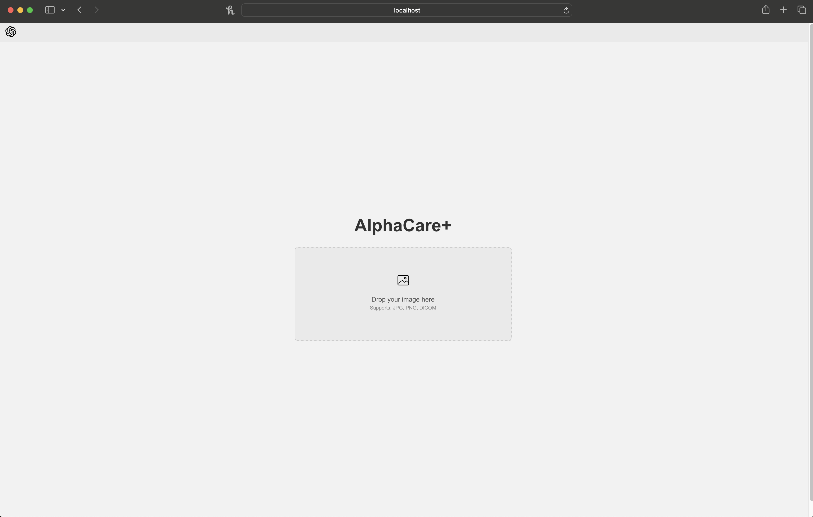
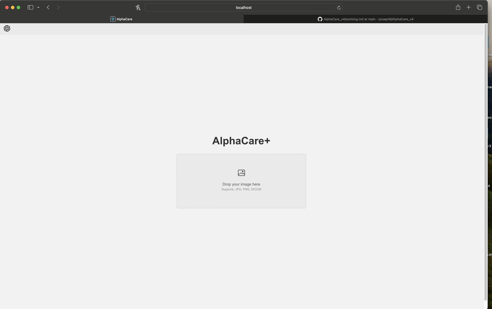
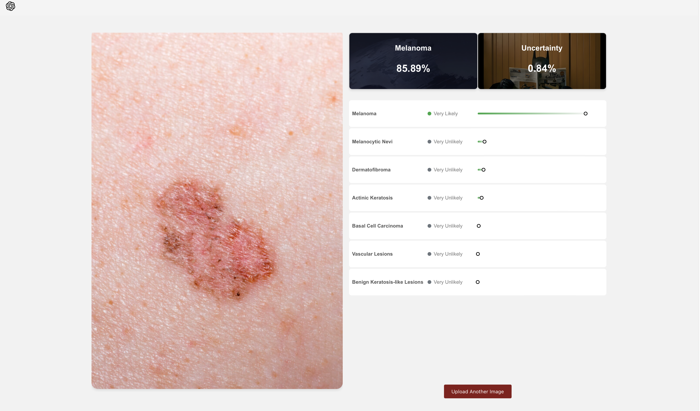
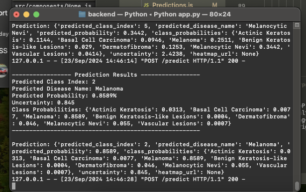

# Current Working

## v1 
Date: September 23

Time: 2:10 PM

## v2
Date: September 23

Time: 2:48 PM

The uncertainty is calculated and displaying properly. The most likely predicted class is being displayed correctly in top box. Also fixed the background color of little circle. 

