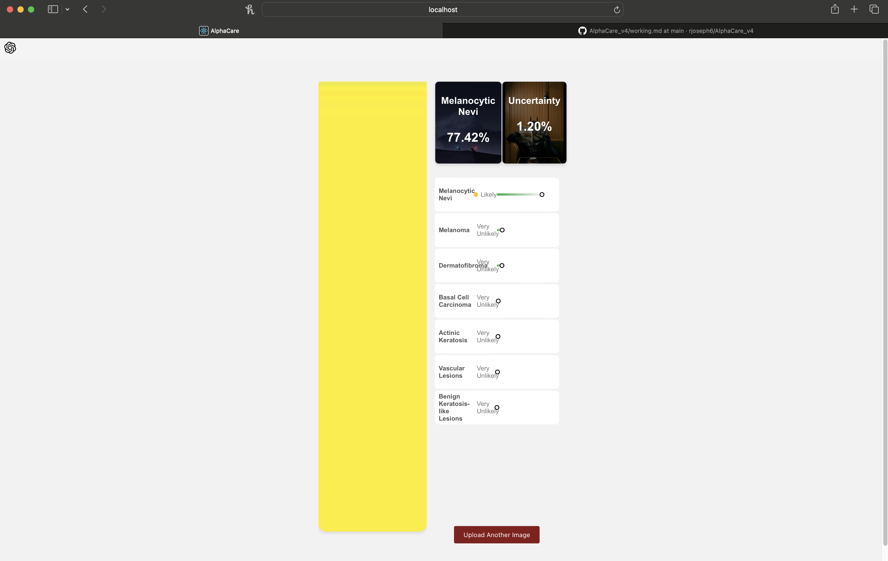
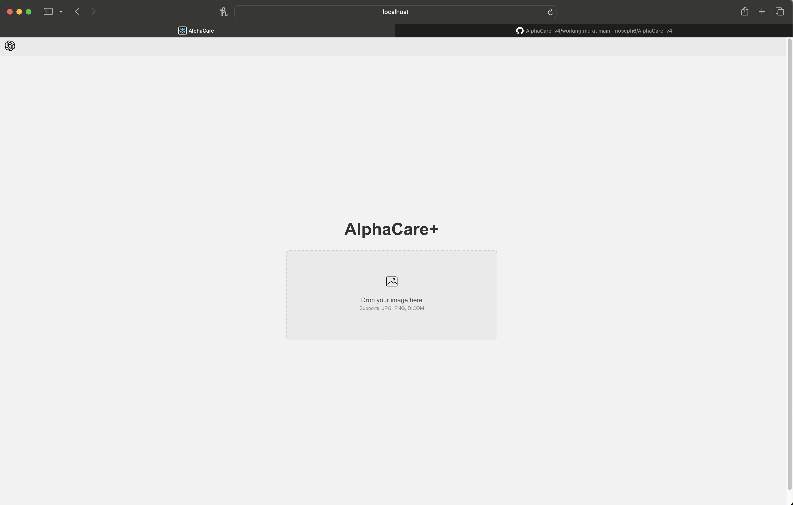
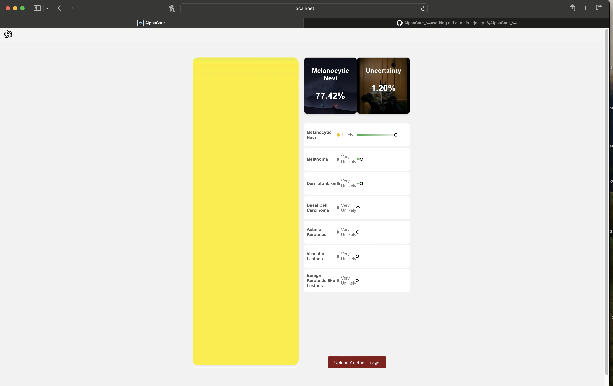

# Current Working

## v1 
Date: September 23

Time: 2:10 PM

## v2
Date: September 23

Time: 2:48 PM

The uncertainty is calculated and displaying properly. The most likely predicted class is being displayed correctly in top box. Also fixed the background color of little circle. 

I need to make it so that the image size is constant so it doesnt mess everything up. Look at bottom image and you see the effects of user uploading an image that is very thin. 

## v3

Date: September 23

Time: 3:17 PM

I switched it so that the right and left sides are compartmentalized. It does seem to fix the problem of very thin images but it did help with making the UI look better by making normal image span entire screen. Need to solve this issue with thin smaller images. 

